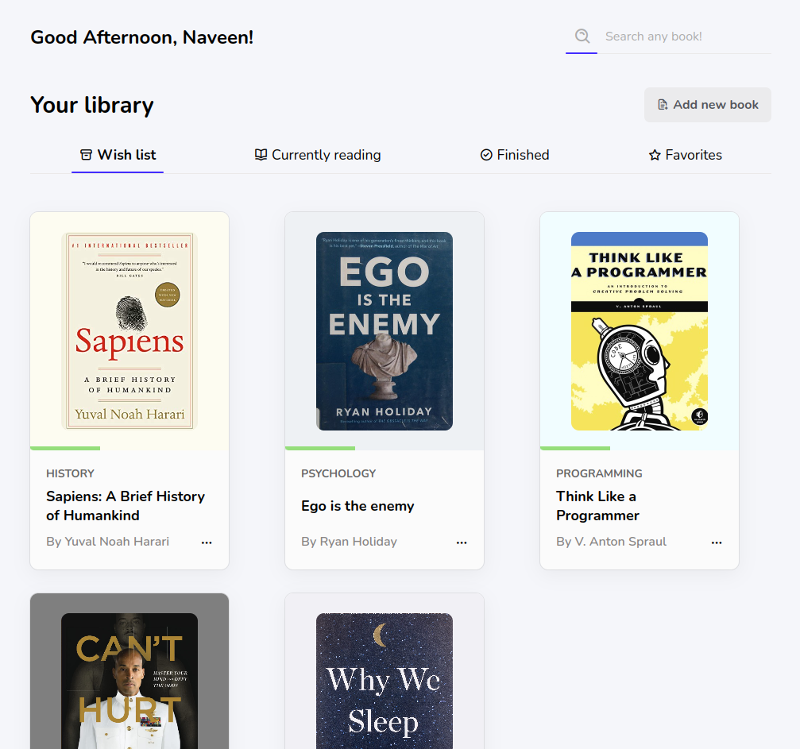

# Hampshire : Library app 📚
“A reader lives a thousand lives before he dies . . . The man who never reads lives only one.” said George R.R. Martin.

So I developed by cool library app

[Checkout the demo](https://creative-dashboard.netlify.app/)

# Features
 
- 👋 **Greetings** - change depending of the time of the day
- 🔍 **Search bar** - Nice search bar to find book on your library with suggestions
- 🍕  **Add new book** - you can add new book to your dashboard
- 🗽  **Reading status** - books are sorted by their reading status and you can  navigate through tabs
- 💢  **Pop up** - menu, delete warning, add form
- ✍️  **Edit existing book** - update the books informations, status, etc
- ℹ️  **Infos** - get more informations about the book
- ⛩️  **Design** - Stunning design

Enjoy the ride!

# Author

Hampshire is developed by [@Naveen](https://github.com/claymeers)